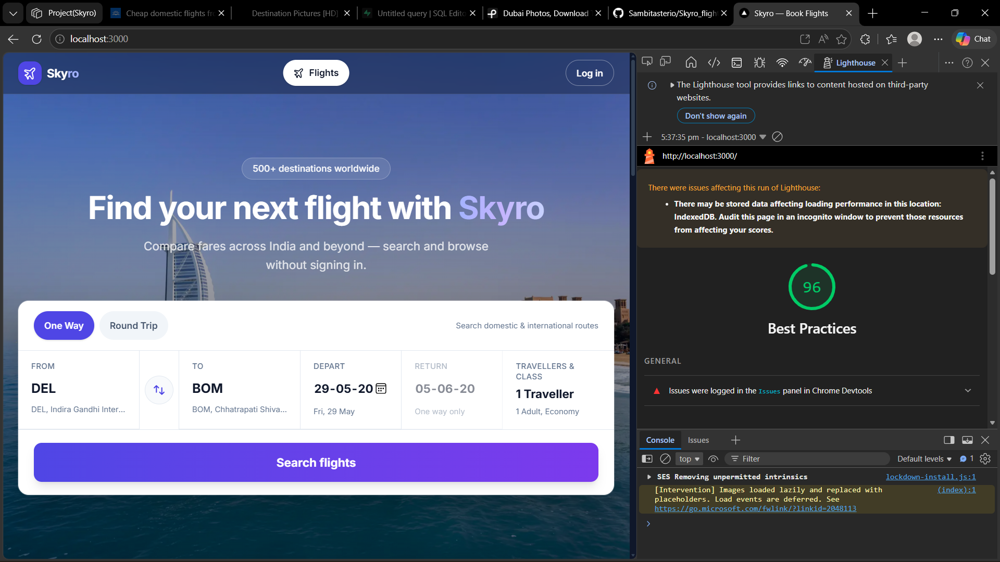

# Skyro — Flight Management PWA

Search flights, pick seats with live availability, book with a PNR, and manage trips (reschedule / cancel) from a protected dashboard.

**Live demo:** [https://skyro-flight.vercel.app](https://skyro-flight.vercel.app) *(replace this URL after you deploy — see [docs/DEPLOY.md](./docs/DEPLOY.md))*

**Repository:** [github.com/Sambitasterio/Skyro_flight](https://github.com/Sambitasterio/Skyro_flight)

---

## Features

| Area | What works |
|------|------------|
| Search | Landing search → results with filters, sort (Best / Cheapest / Fastest), date strip |
| Seats | Visual seat map, cabin zones, **Supabase Realtime** when another user books |
| Booking | Lazy auth, `reserve_seat` RPC, passenger form (gov ID masked in UI, not in localStorage) |
| Confirmation | PNR page, print layout, copy PNR |
| My Bookings | Tabs, detail, **reschedule** (same route), **cancel** (2-hour rule) |
| PWA (bonus) | Installable, service worker, offline fallback — Lighthouse Best Practices **96** ([screenshot](./docs/lighthouse.png)) |

---

## Tech stack

- **Next.js 16** (App Router) · **TypeScript** · **Tailwind CSS v4**
- **Supabase** — Postgres, Auth, Realtime, RLS, RPCs
- **Zustand** — persisted search + booking journey (`partialize` excludes passport/ID)
- **next-pwa** — service worker (production webpack build)

---

## Screenshots

| | |
|---|---|
| Lighthouse (PWA / Best Practices) |  |

Add landing, seat map, and confirmation screenshots under `docs/screenshots/` when you capture them from production.

---

## Local setup

### Prerequisites

- **Node.js 18+**
- **Supabase** project ([supabase.com](https://supabase.com))
- **Git**

### 1. Clone and install

```bash
git clone https://github.com/Sambitasterio/Skyro_flight.git
cd Skyro_flight
npm install
```

### 2. Environment variables

Copy the example file and fill in values from **Supabase → Project Settings → API**:

```bash
cp .env.example .env.local
```

| Variable | Where to find it |
|----------|------------------|
| `NEXT_PUBLIC_SUPABASE_URL` | Project URL |
| `NEXT_PUBLIC_SUPABASE_ANON_KEY` | `anon` `public` key |
| `SUPABASE_SERVICE_ROLE_KEY` | `service_role` key (server only — never expose in client code) |

### 3. Database (Supabase SQL Editor)

Run migrations in order — see **[supabase/README.md](./supabase/README.md)**:

1. `001_create_tables.sql` → `006_rpc_reschedule_booking.sql`
2. `seed.sql`

Enable **Realtime** on table **`seats`** (Supabase → Database → Replication).

### 4. Auth (Supabase dashboard)

- **Authentication → Providers** → enable **Email**
- For local dev: **URL Configuration → Site URL** = `http://localhost:3000`

### 5. Run locally

```bash
npm run dev
```

Open [http://localhost:3000](http://localhost:3000).

**Production / PWA test** (service worker only in production build):

```bash
npm run build
npm run start
```

See **[docs/pwa-setup.md](./docs/pwa-setup.md)** for install + Lighthouse.

---

## Test account (seed)

| | |
|---|---|
| Email | `xyz123@gmail.com` |
| Password | `123456` |

If seed login fails, run **`supabase/scripts/fix-seed-auth-user.sql`** in the SQL Editor, or **Sign up** at `/auth/signup`.

---

## Deploy to Vercel

Full step-by-step (GitHub, env vars, Supabase auth URLs, smoke test):

**[docs/DEPLOY.md](./docs/DEPLOY.md)**

After deploy, update the **Live demo** link at the top of this README.

---

## Docs

| Doc | Purpose |
|-----|---------|
| [docs/DEPLOY.md](./docs/DEPLOY.md) | Vercel + Supabase production setup |
| [docs/pwa-setup.md](./docs/pwa-setup.md) | PWA build, Lighthouse, install |
| [docs/store-persist-checklist.md](./docs/store-persist-checklist.md) | Zustand localStorage checks |
| [docs/architecture.html](./docs/architecture.html) | System diagrams (open in browser) |
| [supabase/README.md](./supabase/README.md) | SQL migration order |

---

## Evaluation checklist (submission)

- [x] Search → seat map → book → PNR → My Bookings
- [x] Realtime seat updates
- [x] Auth + RLS (users see own bookings only)
- [x] Reschedule + cancel (2-hour rule)
- [x] No government ID in `localStorage` ([checklist](./docs/store-persist-checklist.md))
- [x] Responsive UI
- [x] PWA + `docs/lighthouse.png`
- [ ] Live Vercel URL in README *(you add after deploy)*

---

## License

Private / academic project — Skyro internship submission.
