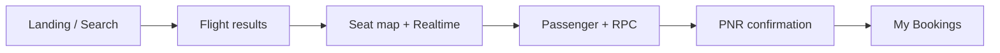
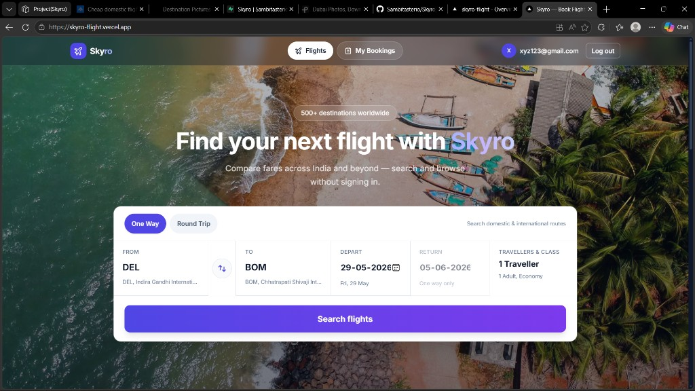
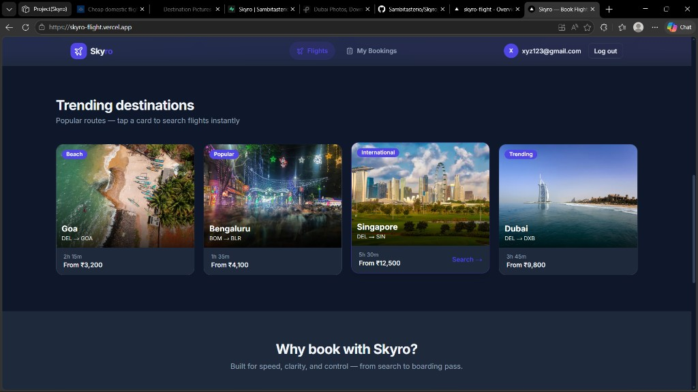
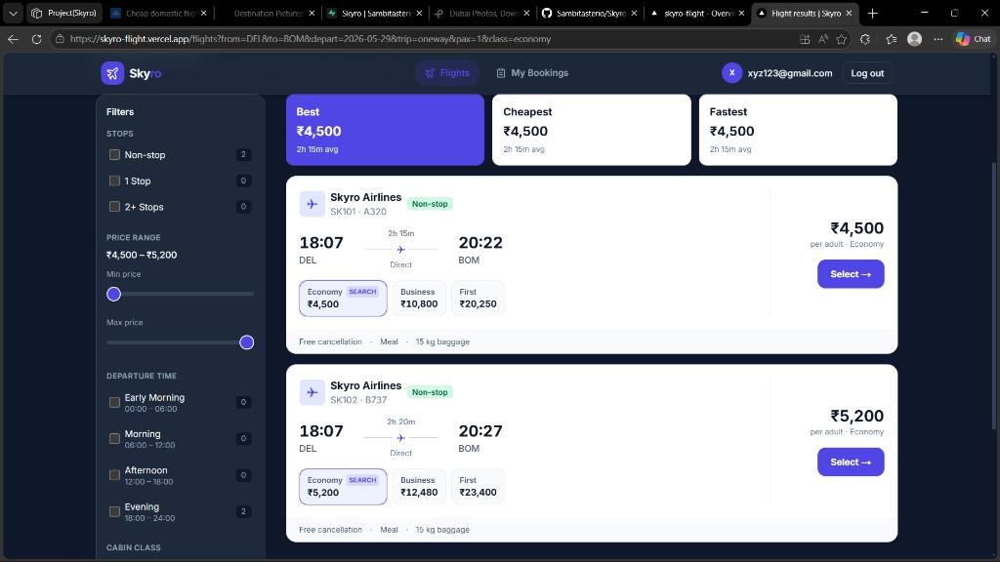
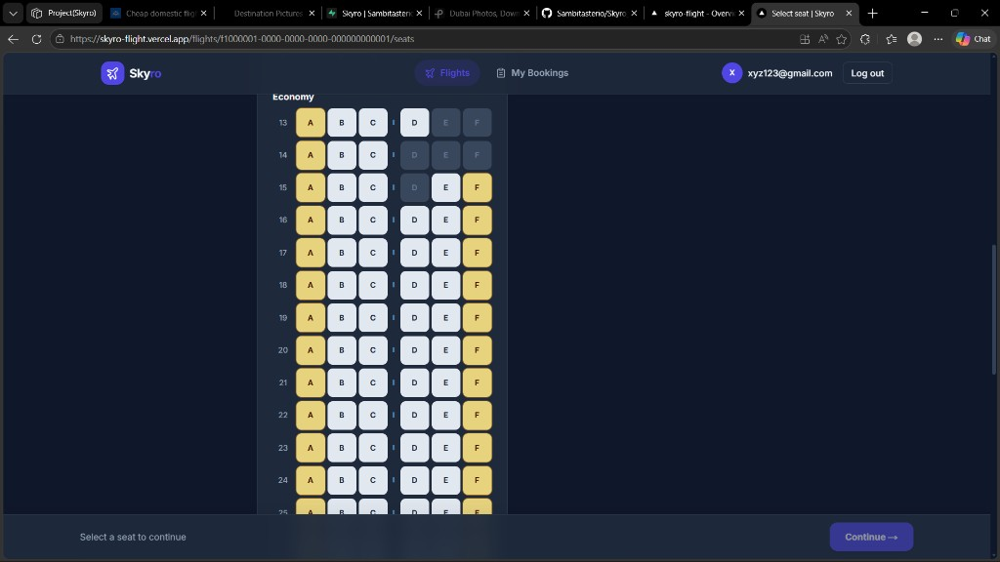
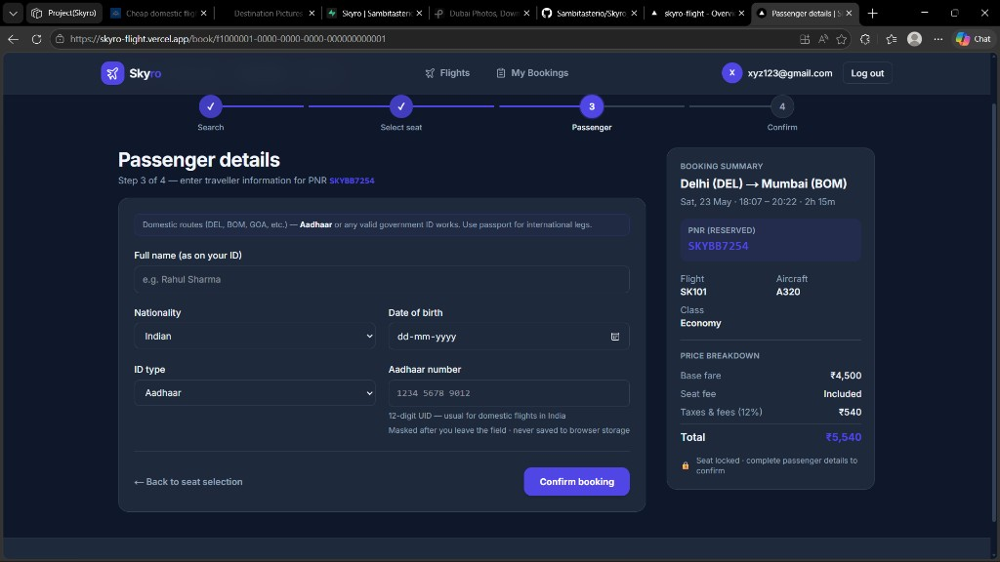

<div align="center">

# ✈ Skyro — Flight Management PWA

**Search · live seat map · book with PNR · manage trips**

[](https://skyro-flight.vercel.app)
[](https://nextjs.org)
[](https://supabase.com)
[](https://www.typescriptlang.org)
[](https://skyro-flight.vercel.app)

[🚀 Try the app](https://skyro-flight.vercel.app) · [📂 Source code](https://github.com/Sambitasterio/Skyro_flight) · [📐 Architecture](./docs/architecture.html)

</div>

---

## Table of contents

- [Overview](#overview)
- [App tour](#app-tour)
- [Features](#features)
- [Tech stack](#tech-stack)
- [Quick start](#quick-start)
- [Test login](#test-login)
- [Deploy](#deploy)
- [Docs](#docs)
- [Submission checklist](#submission-checklist)

---

## Overview

**Skyro** is a responsive flight-booking Progressive Web App: dark Skyscanner-style landing, search results with filters, realtime seat selection, atomic booking via Supabase RPCs, and a protected **My Bookings** dashboard with reschedule and cancel flows.



| | |
|---|---|
| **Live app** | [**https://skyro-flight.vercel.app**](https://skyro-flight.vercel.app) |
| **Repository** | [github.com/Sambitasterio/Skyro_flight](https://github.com/Sambitasterio/Skyro_flight) |

---

## App tour

Click each step to preview the UI (production screenshots).

<details open>
<summary><strong>1 · Landing — search-first hero</strong></summary>

<br>

Rotating destination imagery, unified search card (From / To / dates / travellers), trending routes, and offers — **no login required to browse**.

<p align="center">
  <a href="https://skyro-flight.vercel.app">
    
  </a>
</p>

<p align="center"><a href="https://skyro-flight.vercel.app"><strong>Open landing →</strong></a></p>

</details>

<details>
<summary><strong>2 · Trending destinations</strong></summary>

<br>

One-tap search from popular routes (DEL→GOA, BOM→BLR, DEL→SIN, DEL→DXB).

<p align="center">
  
</p>

</details>

<details>
<summary><strong>3 · Flight results — filters & sort</strong></summary>

<br>

Skyscanner-style summary bar, **Best / Cheapest / Fastest** tabs, sidebar filters (price, stops, departure time, cabin), and flight cards with class pricing.

<p align="center">
  <a href="https://skyro-flight.vercel.app/flights?from=DEL&to=BOM&depart=2026-05-29&trip=oneway&pax=1&class=economy">
    
  </a>
</p>

</details>

<details>
<summary><strong>4 · Seat map — live availability</strong></summary>

<br>

Visual **3-3** grid, cabin zones, tap-to-select, **Supabase Realtime** when another user books the same seat, `reserve_seat` on Continue.

<p align="center">
  
</p>

</details>

<details>
<summary><strong>5 · Passenger details & booking summary</strong></summary>

<br>

Government ID validation (Aadhaar default), masked ID in UI, **ID never stored in localStorage**, sidebar with PNR preview and price breakdown.

<p align="center">
  
</p>

</details>

<details>
<summary><strong>6 · Confirmation & My Bookings</strong></summary>

<br>

After submit → **PNR confirmation** page (print / copy PNR). **My Bookings** lists trips with tabs; detail view supports **reschedule** (same route) and **cancel** (blocked within 2 hours of departure).

<p align="center">
  <a href="https://skyro-flight.vercel.app/bookings"><strong>View My Bookings (after login) →</strong></a>
</p>

</details>

---

## Features

<table>
<tr>
<td width="50%">

### 🔍 Search & discovery
- Dark hero + destination slideshow
- One-way / round-trip search
- Trending route cards
- Inline modify search on results

</td>
<td width="50%">

### 💺 Seats & booking
- Realtime seat map (`seats` table)
- Atomic `reserve_seat` RPC
- Lazy auth at seat selection
- PNR + passenger row

</td>
</tr>
<tr>
<td>

### 📋 My Bookings
- Tabs: All / Upcoming / Past / Cancelled
- Reschedule modal + history
- Cancel with 2-hour rule
- Copy PNR · view confirmation

</td>
<td>

### 🔐 Security & PWA
- Supabase Auth + RLS
- RPCs for seat changes (not direct client UPDATE)
- Zustand `partialize` excludes ID fields
- Installable PWA · offline `/offline` page

</td>
</tr>
</table>

---

## Tech stack

| Layer | Technology |
|-------|------------|
| Frontend | **Next.js 16** App Router · **React 19** · **Tailwind CSS v4** |
| Backend | **Supabase** — Postgres · Auth · Realtime · RLS |
| State | **Zustand** + `persist` (search + booking journey) |
| PWA | **next-pwa** · `manifest.json` · service worker |
| Deploy | **Vercel** |

---

## Quick start

<details>
<summary><strong>📦 Local development (expand)</strong></summary>

### Prerequisites

- Node.js **18+**
- Supabase project
- Git

### 1. Clone & install

```bash
git clone https://github.com/Sambitasterio/Skyro_flight.git
cd Skyro_flight
npm install
```

### 2. Environment

```bash
cp .env.example .env.local
```

| Variable | Supabase → Settings → API |
|----------|---------------------------|
| `NEXT_PUBLIC_SUPABASE_URL` | Project URL |
| `NEXT_PUBLIC_SUPABASE_ANON_KEY` | `anon` public key |
| `SUPABASE_SERVICE_ROLE_KEY` | `service_role` secret |

### 3. Database

Run in **SQL Editor** (order matters):  
[`supabase/README.md`](./supabase/README.md) — `001` … `006` + `seed.sql`

Enable **Realtime** on table **`seats`**.

### 4. Auth (local)

**Authentication → Providers → Email** ON  
**Site URL** = `http://localhost:3000`

### 5. Run

```bash
npm run dev
```

→ [http://localhost:3000](http://localhost:3000)

**PWA / production build:**

```bash
npm run build
npm run start
```

</details>

---

## Test login

Use the seed account on [**live demo**](https://skyro-flight.vercel.app) or locally:

| | |
|---|---|
| **Email** | `xyz123@gmail.com` |
| **Password** | `123456` |

<details>
<summary>Login not working?</summary>

1. Run [`supabase/scripts/fix-seed-auth-user.sql`](./supabase/scripts/fix-seed-auth-user.sql) in SQL Editor, or  
2. **Sign up** at `/auth/signup` on the live site.

Production auth URLs: **Site URL** = `https://skyro-flight.vercel.app` — see [DEPLOY.md](./docs/DEPLOY.md).

</details>

---

## Deploy

Already live at **[skyro-flight.vercel.app](https://skyro-flight.vercel.app)**.

To redeploy or fork: **[docs/DEPLOY.md](./docs/DEPLOY.md)** (Vercel env vars + Supabase redirect URLs).

---

## Docs

| Document | Description |
|----------|-------------|
| [docs/DEPLOY.md](./docs/DEPLOY.md) | Vercel + Supabase production |
| [docs/architecture.html](./docs/architecture.html) | System diagrams (open in browser) |
| [docs/pwa-setup.md](./docs/pwa-setup.md) | PWA build & install |
| [docs/store-persist-checklist.md](./docs/store-persist-checklist.md) | Zustand / localStorage verification |
| [supabase/README.md](./supabase/README.md) | Migrations & seed |

---

## Submission checklist

- [x] Public GitHub repo
- [x] Live Vercel URL — [**skyro-flight.vercel.app**](https://skyro-flight.vercel.app)
- [x] README with setup + test login
- [x] Supabase migrations `001`–`006` + seed
- [x] End-to-end: search → seats → book → PNR → My Bookings
- [x] Realtime seat map
- [x] Reschedule + cancel (2-hour rule)
- [x] No government ID in `localStorage`
- [x] Responsive UI + PWA (installable, service worker)

---

<div align="center">

**Skyro** · Flight Management PWA · 2026

Built with Next.js, Supabase, and Zustand

</div>
